<!--
  Profile README for github.com/contactmridulhere-commits
  Design system: Chromatic Lightflow, matching portfolio-mridul-six.vercel.app. Artwork lives in /assets (light + dark variants).
  The "Latest from the channel" block is refreshed daily by .github/workflows/latest-videos.yml.
-->

<a href="https://portfolio-mridul-six.vercel.app">
  <picture>
    <source media="(prefers-color-scheme: dark)" srcset="assets/banner-dark.svg">
    
  </picture>
</a>

  <a href="https://portfolio-mridul-six.vercel.app"><picture><source media="(prefers-color-scheme: dark)" srcset="assets/btn-portfolio-dark.svg"></picture></a>&nbsp;
  <a href="https://www.linkedin.com/in/mridul-sharma-martian"><picture><source media="(prefers-color-scheme: dark)" srcset="assets/btn-linkedin-dark.svg"></picture></a>&nbsp;
  <a href="https://www.youtube.com/@mridulsharma-martian"><picture><source media="(prefers-color-scheme: dark)" srcset="assets/btn-youtube-dark.svg"></picture></a>&nbsp;
  <a href="https://mexger.com"><picture><source media="(prefers-color-scheme: dark)" srcset="assets/btn-mexger-dark.svg"></picture></a>&nbsp;
  <a href="mailto:contact.mridulhere@gmail.com"><picture><source media="(prefers-color-scheme: dark)" srcset="assets/btn-email-dark.svg"></picture></a>

<b>Open to Summer 2027 internships</b> in embedded systems, AR &amp; wearables R&amp;D and applied on-device AI.

 

I'm a Mechanical Engineering student at **Queen's University Belfast** who designs, solders, codes and ships hardware: **15+ documented builds, 5 live products, 2+ years shipping.** My work sits where hardware, software and AI meet: embedded systems, AR/HUD optics, wearable health sensing and AI that runs fully on-device. Every major build is documented on [YouTube](https://www.youtube.com/@mridulsharma-martian) and on my [portfolio](https://portfolio-mridul-six.vercel.app).

### Now building

- **[Mexger](https://mexger.com)** · a spatial AI studio, now three apps: CAD Studio, UlChats and Textem
- **ANA Smart Glasses V2** · two-brain AR glasses with a waveguide display and an assistant that runs entirely on the frame
- **WALK** · an assistive exoskeleton, moving from simulation to a single-joint bench rig under real load
- **Team Dronestellar** · Infrastructure Lead at the Singapore Defence Tech Hackathon 2026, building an automated battery hot-swap station that keeps drone fleets on station

 

### Shipped · live on the internet

<a href="https://mexger.com"><picture><source media="(prefers-color-scheme: dark)" srcset="assets/card-mexger-dark.webp">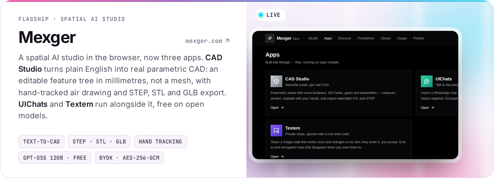</picture></a>

  <a href="https://gestureholo.online"><picture><source media="(prefers-color-scheme: dark)" srcset="assets/card-gestureholo-dark.webp">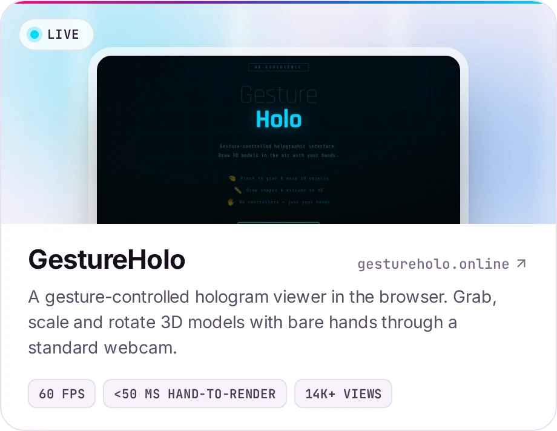</picture></a>
  <a href="https://merser.store"><picture><source media="(prefers-color-scheme: dark)" srcset="assets/card-merser-dark.webp">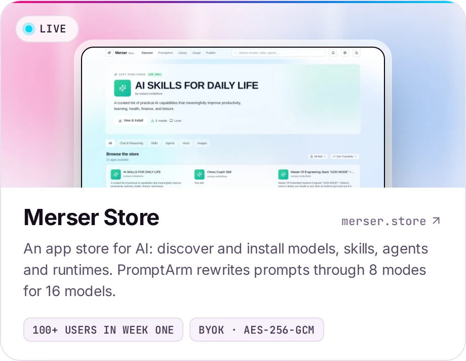</picture></a>

  <a href="https://mygrindin.com"><picture><source media="(prefers-color-scheme: dark)" srcset="assets/card-grindin-dark.webp"></picture></a>
  <a href="https://ulchats.com"><picture><source media="(prefers-color-scheme: dark)" srcset="assets/card-ulchats-dark.webp">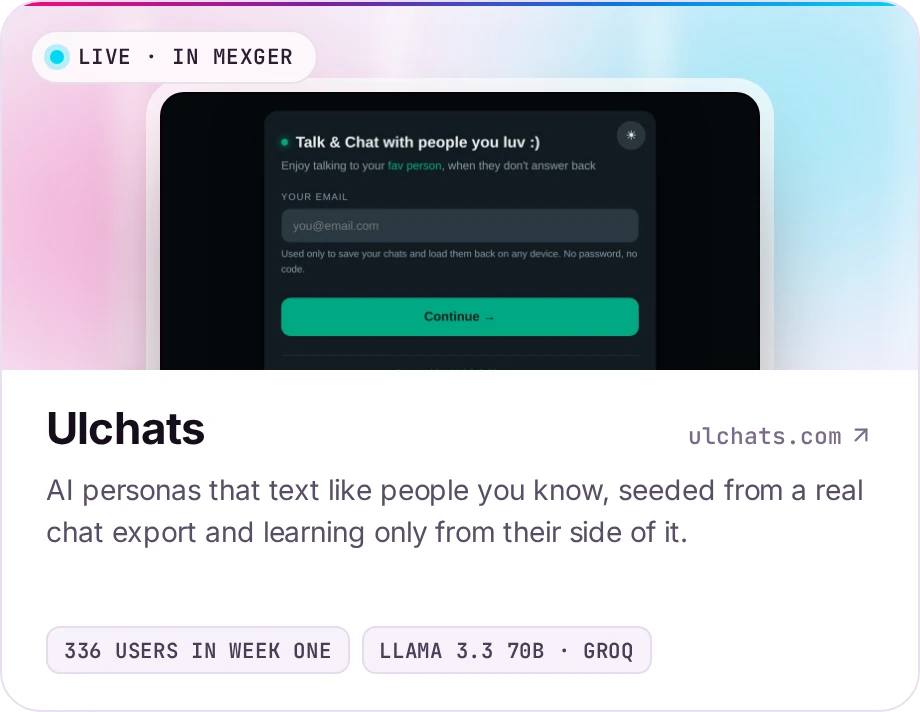</picture></a>

 

### Hardware · on the bench, in a visor, strapped to a leg

<a href="https://github.com/contactmridulhere-commits/Smart-glasses"><picture><source media="(prefers-color-scheme: dark)" srcset="assets/card-ana-dark.webp">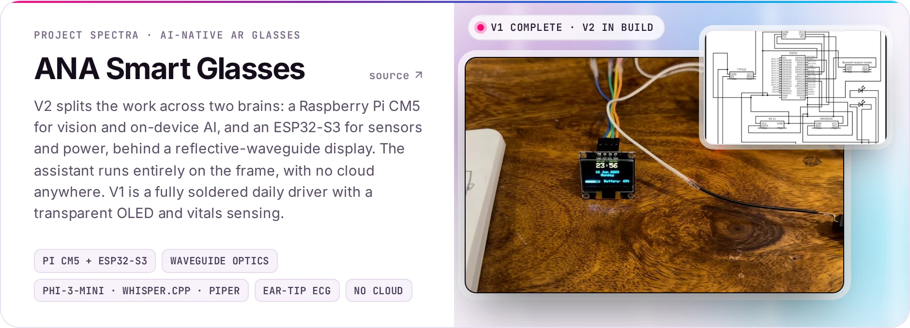</picture></a>

  <a href="https://github.com/contactmridulhere-commits/Multi-Vital-Device"><picture><source media="(prefers-color-scheme: dark)" srcset="assets/card-vitals-dark.webp">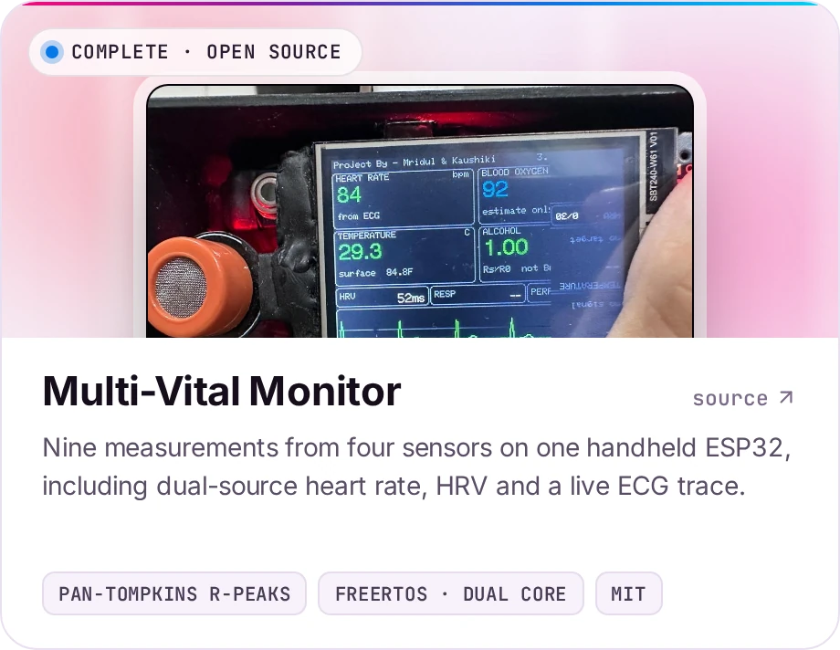</picture></a>
  <a href="https://github.com/contactmridulhere-commits/Heads-Up-Dislay"><picture><source media="(prefers-color-scheme: dark)" srcset="assets/card-hud-dark.webp">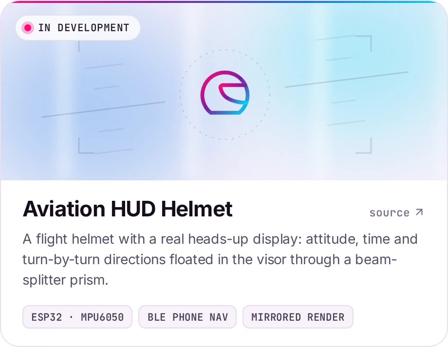</picture></a>

  <a href="https://github.com/contactmridulhere-commits/See-thru-walls-wifi-V3"><picture><source media="(prefers-color-scheme: dark)" srcset="assets/card-wifi-dark.webp">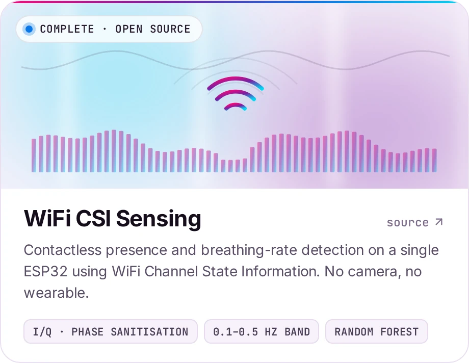</picture></a>
  <a href="https://portfolio-mridul-six.vercel.app/#projects"><picture><source media="(prefers-color-scheme: dark)" srcset="assets/card-walk-dark.webp">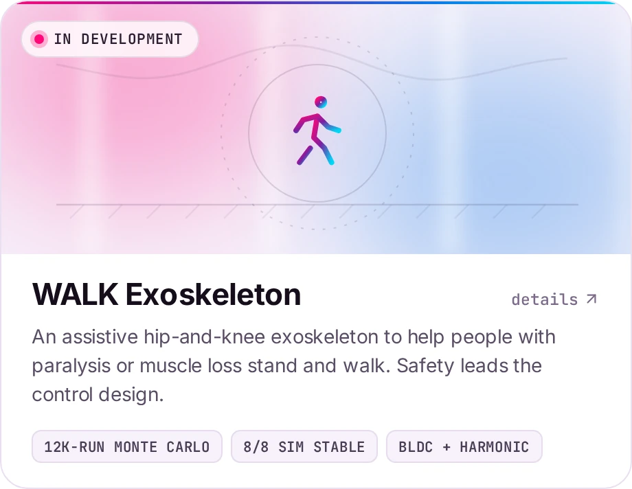</picture></a>

 

### Stack

<picture><source media="(prefers-color-scheme: dark)" srcset="assets/stack-dark.webp">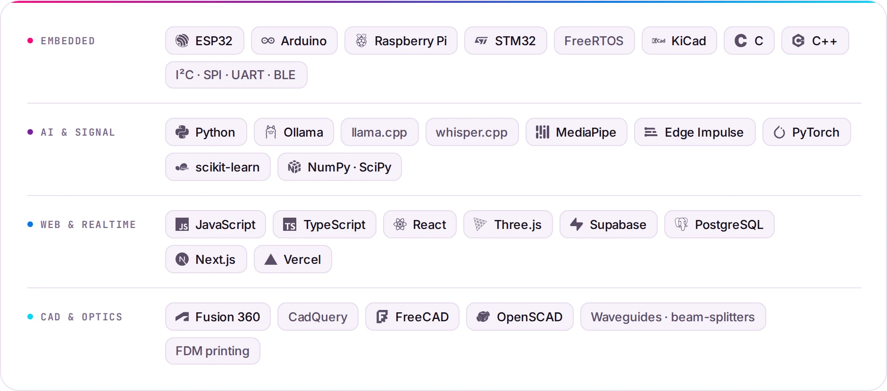</picture>

 

### Credentials

- **OpenAI Academy** · Agents and Workflows · Aug 2026 · [verify](https://academy.openai.com/public/certificate/07xbqookpr)
- **Anthropic** · Claude Platform 101 · Aug 2026 · [verify](https://verify.skilljar.com/c/qsgqp3xs34wi)
- **Qualcomm Academy** · AI Upskilling Certificate: Hands-On Development from Model to App · Jun 2026 · credential ID `9QgWgwHN7s`

> *"He is among the very best students I have taught."*
>  Dr Oleksandr Malyuskin, Senior Lecturer (Associate Professor), Centre for Wireless Innovation, Queen's University Belfast

 

### Latest from the channel

<!-- VIDEOS:START -->

  
  
  

<!-- VIDEOS:END -->

<a href="https://www.youtube.com/@mridulsharma-martian">Shorts, build logs and everything else on YouTube</a>

<picture><source media="(prefers-color-scheme: dark)" srcset="assets/footer-dark.svg"></picture>

Belfast, UK · <a href="mailto:contact.mridulhere@gmail.com">contact.mridulhere@gmail.com</a>

